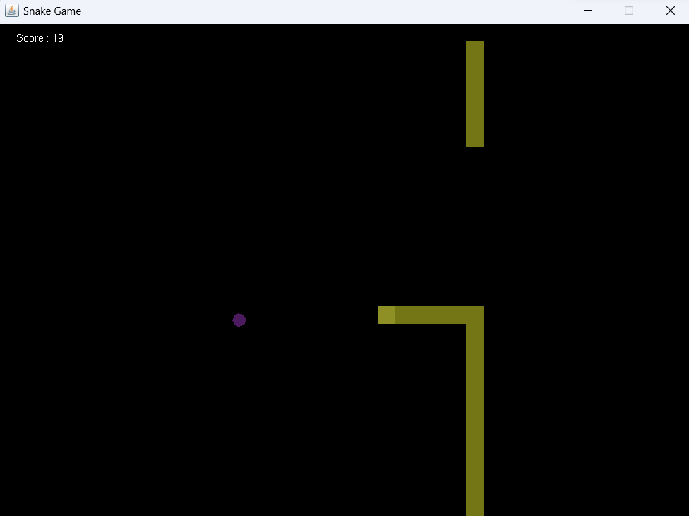
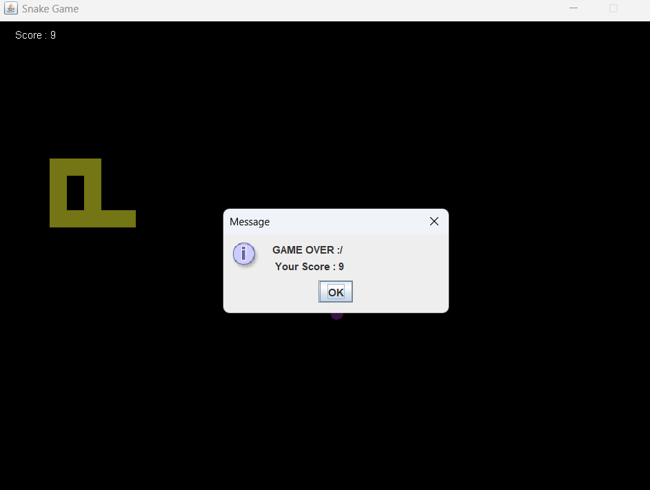

# Snake Game With Java

This is a classic implementation of the iconic Snake Game using Java. This GitHub project delivers a visually appealing Snake Game, featuring smooth controls and vibrant graphics. The game is built using Java and Swing. Players can navigate the snake through the grid, aiming to consume randomly generated points to increase their score and avoid their own tail. 

## Screenshots

